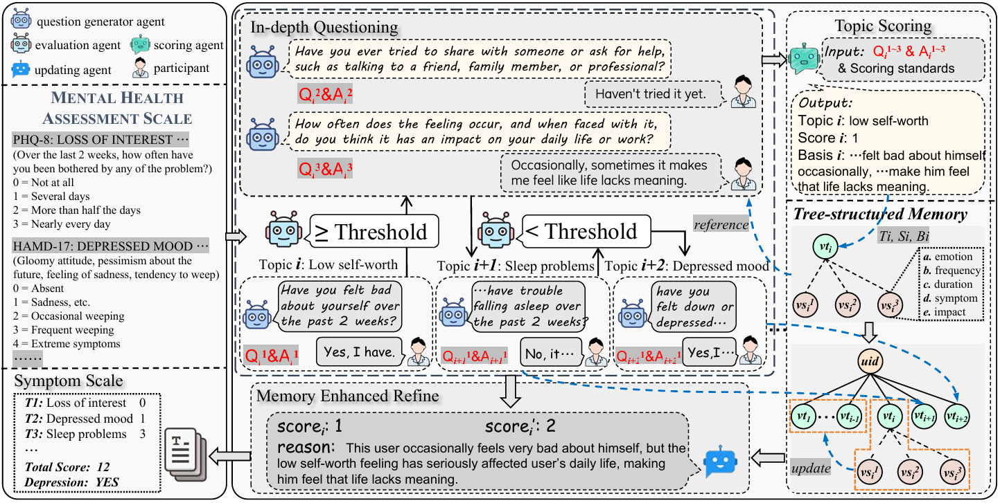

# AgentMental: An Interactive Multi-Agent Framework for Explainable and Adaptive Mental Health Assessment

AgentMental is an interactive multi-agent framework designed for mental health assessment that simulates clinical doctor-patient dialogues to overcome the limitations of static text analysis and insufficiently in-depth user assessment. The framework coordinates four specialized agents—for questioning, adequacy evaluation, scoring, and updating—to implement an adaptive questioning mechanism that actively clarifies vague responses and elicits richer details regarding symptom severity and impact. To maintain contextual coherence and reduce redundancy, the system utilizes a tree-structured memory module that systematically organizes user attributes, topic-level summaries, and turn-level evidence such as symptom duration and frequency. Experimental evaluations on the DAIC-WOZ dataset demonstrate that AgentMental significantly outperforms existing prompt-based and multi-agent baselines, achieving superior performance in metrics such as F1 score and MAE while providing a explainable evaluation process.



## Quick Start

Clone this project locally
```bash
git clone https://github.com/MACLAB-HFUT/AgentMental.git
```

Create a new virtual environment, e.g. with conda or miniconda 
```bash
~$ conda create -n agentmental python>=3.10
```

Activate the environment:
```bash
~$ conda activate agentmental
```

Install the required packages:
```bash
~$ pip install -r requirements.txt
```

Replace your model, base_url and api_key with your actual model, base_url and API keys in files ```OAI_CONFIG_LIST, generate_response.py, memory.py```.

Run
```bash
~$ python main.py
```

## Data

Download the dataset
```bash
~$ python data_download.py
```

Data processing
```bash
~$ python extract_data.py
~$ python data_process.py
```

Your directory structure should look like this:
```
AgentMental/
├── data/
│   ├── data_download.py
│   ├── data_process.py
│   ├── extract_data.py
│   ├── processed_train_daic_woz
│   └── ... (other dataset files)
├── evaluation
├── scales
├── src
├── result.py
├── requirements.txt
└── README.md
```

## Citation

If this work is helpful, please kindly cite as:

```bibtex
@article{hu2025agentmental,
  title={Agentmental: An interactive multi-agent framework for explainable and adaptive mental health assessment},
  author={Hu, Jinpeng and Wang, Ao and Xie, Qianqian and Ma, Hui and Li, Zhuo and Guo, Dan},
  journal={arXiv preprint arXiv:2508.11567},
  year={2025}
```

